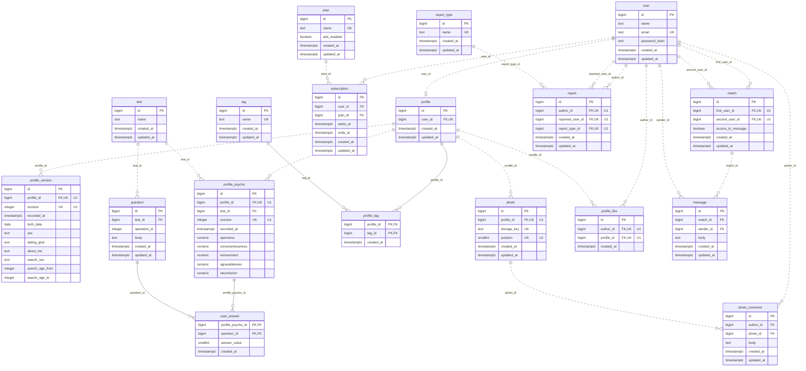

# ER-диаграмма Totally Swipes

Диаграмма отражает ограничения SQL из [начальной миграции](../migrations/000001_init.up.sql). Назначение полей и бизнес-правила описаны в [relations.md](relations.md).

`||` — ровно одна запись, `o|` — ноль или одна, `o{` — ноль или много. `PK` — первичный ключ, `FK` — внешний ключ, `UK` — уникальный ключ. Комментарии `U1` обозначают поля одного составного уникального ключа внутри таблицы.

У пользователя может быть **0..1 анкета**, у каждой анкеты — ровно один пользователь. `UNIQUE (profile.user_id)` сохраняется. Backend при регистрации создаёт пользователя и анкету в одной транзакции. Профиль без версий SQL также допускает, поэтому связь с `profile_version` показана как `0..N`.

